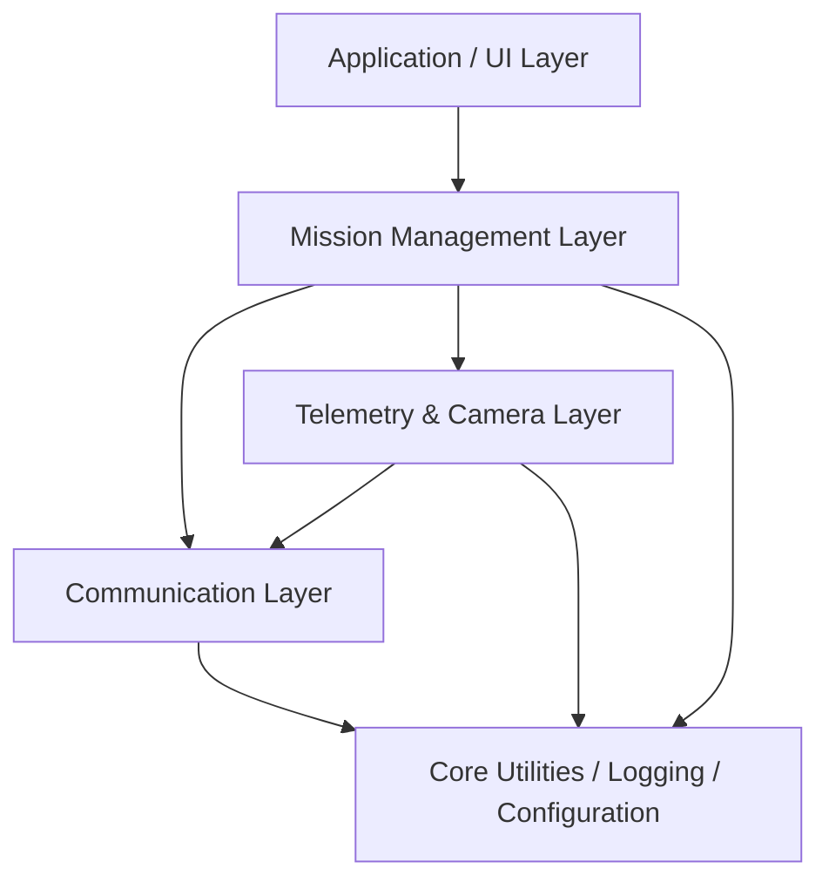

# 🚁 DroneControl Suite

A modular C++ mission planning and drone control framework designed for autonomous UAV operations.

<!-- Logo placeholder: assets/logo/ -->
<!-- Demo GIF placeholder: assets/videos/demo.gif -->
<!-- Screenshot placeholder: assets/images/ -->


## 🎥 Demo

Demo media will be added as the project evolves.

- Demo GIF: `assets/videos/demo.gif`
- Demo video: `assets/videos/demo.mp4`
- Screenshots: `assets/images/`

## About

DroneControl Suite is a modular UAV mission planning and control framework written in Modern C++.

This project serves as a long-term engineering platform for experimenting with modular UAV mission software, scalable software architecture, and autonomous system design using Modern C++.

The project is designed to gradually integrate mission planning, telemetry processing, camera systems, MAVLink communication, and future ROS2/PX4 support.

## Current Status

The project is currently under active development.

### Implemented

- Professional repository structure
- Modular `include/` and `src/` folder layout
- CMake build system
- Configuration file structure
- GitHub Actions CI workflow
- Documentation structure
- Placeholder modules for future implementation

### In Progress

- Mission Manager
- Telemetry Manager
- Logging module
- MAVLink communication layer
- Camera module

### Planned

- ROS2 integration
- PX4 integration
- Gazebo simulation
- QGroundControl support
- AI Vision module
- Multi-UAV support

## Features

> Note: This section describes the intended project capabilities. Current implementation status is listed in the **Current Status** section.

- Modular UAV mission software architecture
- Mission planning with waypoint management
- MAVLink-based vehicle communication
- Real-time telemetry processing
- Camera module for future vision-based tasks
- Centralized logging and diagnostics
- External configuration management
- Unit and integration testing structure
- Cross-platform build system with CMake
- Future ROS2 node integration
- Future PX4 and Gazebo simulation support

## 🛠️ Tech Stack

- C++20
- CMake
- MAVLink
- Mission Planner
- GitHub Actions
- ROS2 (planned)
- PX4 (planned)
- Gazebo (planned)

## Architecture

DroneControl Suite is organized as a layered UAV software framework. Each module has a clear responsibility and can evolve independently as the project grows.



### Planned Diagrams

The following diagrams will be added as the implementation becomes more complete:

- Software Architecture Diagram
- Class Diagram
- Module Dependency Diagram
- Data Flow Diagram
- Mission Flow Diagram

Detailed architecture documentation is available in [`docs/architecture.md`](docs/architecture.md).

## 📁 Repository Layout

```text
DroneControlSuite/
├── .github/              # GitHub workflows and contribution templates
├── assets/               # Images, videos, logos, and demo media
├── config/               # Runtime configuration files
├── docs/                 # Architecture, module, and roadmap documentation
├── include/              # Public C++ headers organized by module
├── src/                  # Source files mirroring the include structure
├── tests/                # Unit, integration, and mock-based tests
├── third_party/          # External dependencies and vendor libraries
├── tools/                # Helper utilities for logs, missions, and telemetry
├── scripts/              # Build, run, and formatting scripts
├── examples/             # Example usage and sample integrations
├── CMake/                # Custom CMake modules
├── CMakeLists.txt        # Main CMake build configuration
├── README.md             # Project overview
├── LICENSE               # MIT license
├── CHANGELOG.md          # Version history
├── CONTRIBUTING.md       # Contribution guide
├── .gitignore            # Ignored build and IDE files
└── .clang-format         # C++ formatting rules
```

## ⚙️ Installation

```bash
git clone https://github.com/umutbgr/DroneControlSuite.git
cd DroneControlSuite
mkdir build
cd build
cmake ..
cmake --build .
```

Alternative CMake workflow:

```bash
cmake -S . -B build
cmake --build build
```

## Usage

Linux/macOS:

```bash
./build/MissionControl
```

Windows:

```powershell
.\build\MissionControl.exe
```

## Modules

### Core
Provides shared application primitives, lifecycle management, and common interfaces used across the framework.

### Communication Layer
Handles communication with external UAV systems and prepares the project for MAVLink-based integration.

### Mission Manager
Responsible for mission planning, waypoint handling, and autonomous task execution flow.

### Telemetry Manager
Collects, validates, and manages flight telemetry data such as position, altitude, attitude, and system status.

### Camera Manager
Provides a dedicated layer for camera integration, image acquisition, and future computer vision support.

### Logger
Provides centralized logging for debugging, mission tracing, and runtime diagnostics.

### Config Manager
Loads mission, camera, drone, and telemetry settings from external configuration files instead of hardcoded values.

### UI
Contains user-facing interfaces and future visualization components.

## Engineering Decisions

### Why Modern C++?
Modern C++ provides performance, type safety, deterministic resource management, and strong control over system-level behavior, making it suitable for UAV mission software.

### Why CMake?
CMake enables cross-platform builds and provides a scalable build structure for future modules, tests, and external dependencies.

### Why Modular Architecture?
A modular structure keeps mission planning, telemetry, camera, communication, and UI logic separated. This improves maintainability and makes the system easier to extend.

### Why MAVLink?
MAVLink is a widely used communication protocol in UAV systems and provides compatibility with tools such as Mission Planner, PX4, and ArduPilot-based platforms.

### Why Mission Planner?
The project currently targets Mission Planner for testing and MAVLink communication because it is widely used in UAV development, supports ArduPilot-based workflows, and provides a practical environment for validating mission and telemetry behavior.

### Why Not Python?
Python is excellent for prototyping, scripting, and rapid experimentation. This project focuses on building a performance-oriented and scalable mission software architecture using C++.

### Future Migration to ROS2
The current architecture is designed so that mission, telemetry, and communication modules can later be adapted into ROS2 nodes.

## Planned Design Patterns

The following design patterns may be introduced where they provide clear architectural value:

- **Factory** for creating communication, camera, or mission components.
- **Observer** for telemetry updates and event-driven state changes.
- **Strategy** for interchangeable mission execution behaviors.
- **Singleton** only for carefully controlled global services, if necessary.

## Coding Standards

- C++20 standard
- `.clang-format` based formatting
- RAII-based resource management
- Prefer smart pointers over raw owning pointers
- Prefer `const` correctness
- Keep module interfaces small and explicit
- Avoid hardcoded runtime values; use files under `config/`
- Follow modern C++ practices inspired by the Google C++ Style Guide where appropriate

## Development Workflow

```text
Feature Branch
      ↓
Pull Request
      ↓
CI Build
      ↓
Code Review
      ↓
Merge
```

## Versioning

This project follows Semantic Versioning.

```text
v0.1.x  Initial architecture and module scaffolding
v0.2.x  Core mission, telemetry, and communication features
v1.0.0  Stable mission control framework
```

## Documentation

- [Architecture](docs/architecture.md)
- [Getting Started](docs/getting_started.md)
- [Modules](docs/modules.md)
- [Roadmap](docs/roadmap.md)
- [API Documentation](docs/api/README.md)

## Roadmap

- ✅ Project structure
- ✅ Modular architecture
- ✅ CMake build system
- ✅ GitHub Actions CI
- ⬜ Logging module implementation
- ⬜ Mission Manager
- ⬜ Telemetry Manager
- ⬜ MAVLink communication
- ⬜ ROS2 nodes
- ⬜ PX4 integration
- ⬜ Gazebo simulation
- ⬜ QGroundControl support
- ⬜ AI Vision module
- ⬜ Multi-UAV support

## Motivation

This project serves as a long-term engineering platform for experimenting with modular UAV mission software, scalable software architecture, and autonomous system design using Modern C++.

The goal is not only to build a working application, but also to demonstrate clean project organization, maintainable architecture, documentation discipline, testing structure, and engineering decision-making.

## What I Learned

- Modern C++ project organization
- CMake-based build configuration
- Modular software architecture
- UAV mission planning concepts
- Configuration-driven application design
- Documentation-first engineering habits
- Scalable repository structure

## Engineering Goals

- Build a scalable mission software architecture
- Apply Modern C++ best practices
- Design maintainable modular components
- Prepare the project for ROS2 and PX4 integration

## Future Work

- ROS2 integration
- PX4 support
- Gazebo simulation
- SLAM
- Computer vision
- Object tracking
- AI mission planning
- Cloud telemetry

## Acknowledgements

- MAVLink
- PX4
- Mission Planner
- ROS2
- ArduPilot ecosystem

## 📄 License

This project is licensed under the MIT License. See [`LICENSE`](LICENSE) for details.

## 📬 Contact

- GitHub: [umutbgr](https://github.com/umutbgr)
- LinkedIn: https://linkedin.com/in/umut-buğra-şahin-9a0764298
- Email: umutbugrasahin366@gmail.com

If you have suggestions or feedback, feel free to open an issue or contact me.
